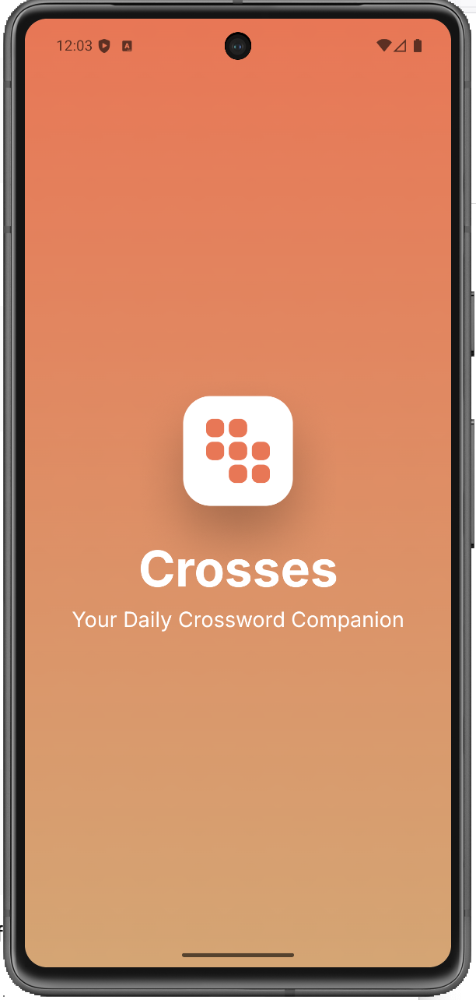
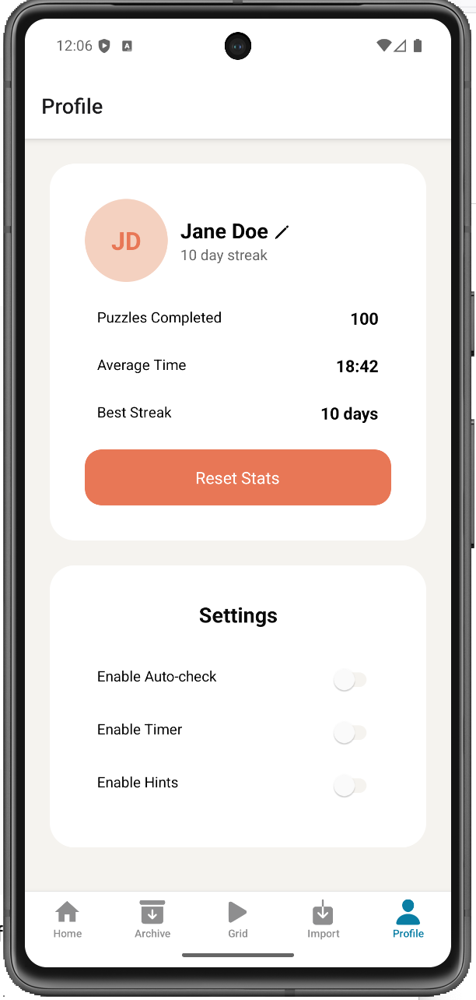

# Crosses

Crosses is a mobile crossword ppuzzle app built with React Native, Expo, and TypeScript.
The app allows users to import crossword puzzle files, solve them in an interacttiv grid, track puzzle completion progress, and maintain a daily streak based on completed puzzles.

## 📱 App Preview

<p align="center">
  
   
  
</p>

## Features

### Home Screan

- Display the current date
- Shows a daily streak based on completed puzzles
- Displays a puzzle preview card

### Puzzle Grid

- Interactive crossword solving interface
- Tracks user answers
- Supports clue navigation
- Detects puzzle completion

### Import

- Imports local crossword `.puz` files
- Downloads daily puzzles from The New Yorker
- Parses puzzle content for play in the app
- Supports previewing imported puzzle details before starting

### Profile

- Displays editable user information
- Supports avatar selection
- Persists profile data locally

## Tech Stack

- React Native
- Expo
- TypeScript
- Expo Router
- AsyncStorage
- xd-crossword-tools

## Project

```
.github/workflows/  GitHub Actions workflows
.eas/workflows/     Expo EAS workflows
app/                Screen routes
components/         Reusable UI components
contexts/           Shared app state
hooks/              Custom hooks
types/              Type definitions
utils/              Utility functions
```

## Get started

### Running the App

1. Install dependencies

   ```bash
   npm install
   ```

2. Start the development server:

   ```bash
   npx expo start --dev-client
   ```

3. Run Android locally::

   ```bash
   npx expo run:android
   ```

### Running the App (Expo Go)

1. Install dependencies

   ```bash
   npm install
   ```

2. Start the app:

   ```bash
   npx expo start
   ```

In the output, you'll find options to open the app in a

- [development build](https://docs.expo.dev/develop/development-builds/introduction/)
- [Android emulator](https://docs.expo.dev/workflow/android-studio-emulator/)
- [iOS simulator](https://docs.expo.dev/workflow/ios-simulator/)
- [Expo Go](https://expo.dev/go), a limited sandbox for trying out app development with Expo

You can start developing by editing the files inside the **app** directory. This project uses [file-based routing](https://docs.expo.dev/router/introduction).

## CI/CD (GitHub Actions)

This project includes automated workflows for formatting checks and preview/native build support.

1. **Prettier Workflow**

   `File: .github/workflows/prettier.yaml`

This GitHub Action runs Prettier checks to ensure code formatting stays consistent across the project.

It runs on:

- push to main
- pull requests targeting main
- manual dispatch

Steps include:

- checking out the repository
- setting up Node.js
- installing dependencies
- running npm run prettier:check

This helps catch formatting issues before code is merged.

2. **Native Build Workflow**

   `File: .eas/workflows/pr-build.yml`

This EAS workflow is configured to run on pull requests into main when relevant native/app configuration files change.

It watches changes to:

- package.json
- app.json
- app.config.js
- android/\*\*
- ios/\*\*

The workflow performs:

- Android development client build
- using the development profile

This helps verify that native changes still build correctly.

3. PR Preview Update Workflow

   `File: .eas/workflows/publish-preview-update.yml`

This EAS workflow updates the preview branch for pull requests into main.

It publishes preview updates using the PR branch name:

```
${{ github.head_ref || github.ref_name }}
```

This allows the tema to test updated preview builds more easily during review.

## Local Dev Proxy for The New Yorker (Web)

Use this only for local web development (`web + __DEV__`) to avoid CORS when importing from The New Yorker.

```bash
# terminal 1
npm run proxy:tny

# optional, if not using localhost:8787
EXPO_PUBLIC_TNY_PROXY_URL=http://localhost:8787
# terminal 2
npm run web
```

Then open Import and toggle **The New Yorker**.
Production builds do not use this local proxy.
